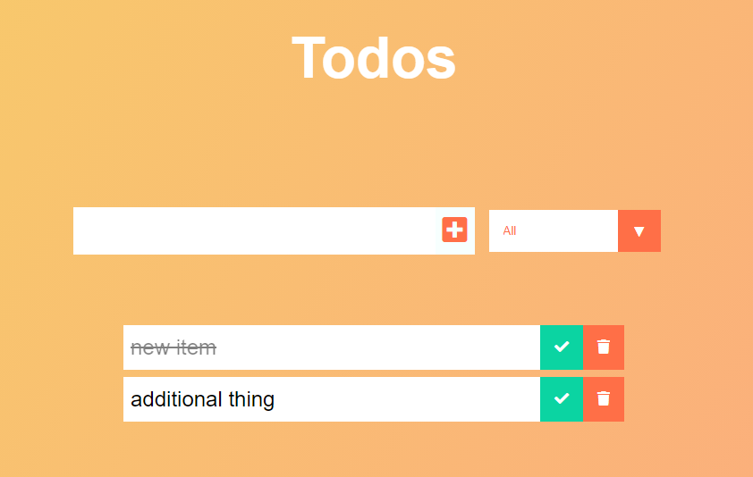

#### Todo App

This small react project was developed alongside the <a href="https://youtu.be/pCA4qpQDZD8">this youtube video tutorial</a> made by Simo Edwin (<a href="https://github.com/developedbyed">Dev Ed</a>)

The project utilises React to create a simple Todo app. Todo Items are generated and rendered to the DOM on enter from the setFiltered State instead of modifying and mutating the original array of Todos during filtering. They can be updated to show they are completed/uncompleted. In addition, the user can delete an item from the todo list, removing it from the localStorage and from the project's State.

Filtering functionality is implemented and allows the user to see `all`, `complete` or `incomplete` tasks in the list.

Todos are saved to local Storage and available via the `setTodos` state. 